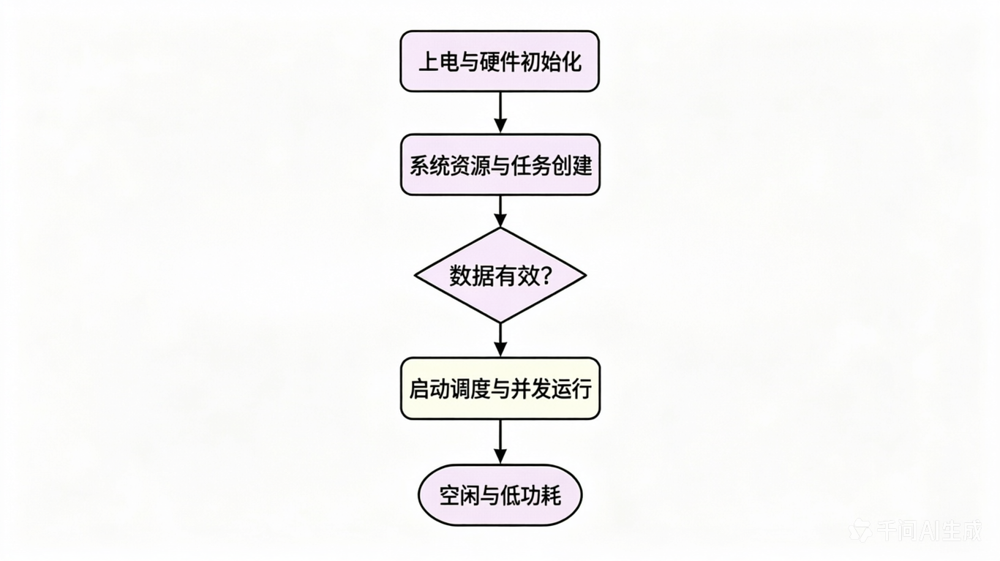

# 《系统设计文档》

## 一、物料到位情况

本项目所需的核心物料已全部采购到位，经实物与清单核对，型号与数量均无误，具体包括：STM32F103C8T6主控芯片、1.3寸I2C接口OLED显示屏、MPU6050六轴陀螺仪传感器、3.7V锂电池及Type-C接口等。目前所有硬件模块均已完成初步的功能测试。

## 二、系统方案设计

本智能手表系统采用分层模块化架构，自下而上划分为硬件层、驱动层、RTOS内核层及应用层。硬件层以STM32F103C8T6为核心，集成电源管理、人机交互、姿态感知及无线通信模块；驱动层封装了I2C、GPIO、UART及定时器等底层接口；RTOS内核层基于FreeRTOS实现多任务调度与资源管理；应用层则负责多级菜单UI渲染、计步算法解算及蓝牙数据透传。系统硬件框图清晰展示了主控与各外设间的电源及信号流向，软件流程图则涵盖了从硬件初始化、RTOS任务创建到多任务并发运行的完整逻辑闭环。

## 三、详细设计文档

### 1．硬件部分设计

硬件电路以STM32F103C8T6最小系统为基础，核心电源管理采用“Type-C输入＋TP4056充电＋PMOS一键开机＋LDO稳压”的拓扑结构。Type-C接口通过5.1kΩ下拉电阻识别5V 输入，经TP4056为3.7V锂电池充电；系统通过PMOS管与NPN三极管构成自锁电路实现一键开机与软关机，最终由AMS1117-3.3将电池电压稳定降至3.3V供系统使用。关键元件参数计算方面，TP4056的充电电流设定电阻Rprog选取1.2kΩ，以实现约1A的安全充电电流；I2C总线（PB6-SCL，PB7-SDA）挂载OLED与MPU6050，均配置4.7kΩ上拉电阻以确保通信电平稳定。

### 2．软件部分设计

软件模块划分为UI显示、传感器采集、时间管理及蓝牙通信四大核心任务。

关键算法采用波峰检测法处理MPU6050的加速度数据以实现精准计步，并利用数字低通滤波器滤除高频运动噪声。

外设配置上，I2C通信速率设定为400kHz,UART1波特率设为115200以适配蓝牙模块。

在FreeRTOS任务调度设计中，系统共创建4个应用任务：蓝牙通信任务（优先级3，堆栈512字）处理高实时性数据收发；传感器采集与时间管理任务（优先级2，堆栈分别为512字和256字）负责数据解算与基准维护；UI显示任务（优先级1，堆栈1024字）负责界面渲染。任务间通过互斥信号量（Mutex）保护共享的I2C总线，通过消息队列（Queue）实现传感器数据向UI任务的单向传递，有效避免了资源竞争与死锁。

## 四、进度汇报

当前项目已完成需求分析与整体方案设计，硬件电路原理图绘制完毕，FreeRTOS已成功移植至STM32F103C8T6并完成了基础任务的创建与调度测试。后续工作计划分为三个阶段：第一阶段完成MPU6050驱动调试与计步算法验证；第二阶段实现OLED多级菜单UI及蓝牙数据同步功能；第三阶段进行系统联调、低功耗优化，并整理完整的设计文档准备分组汇报。

